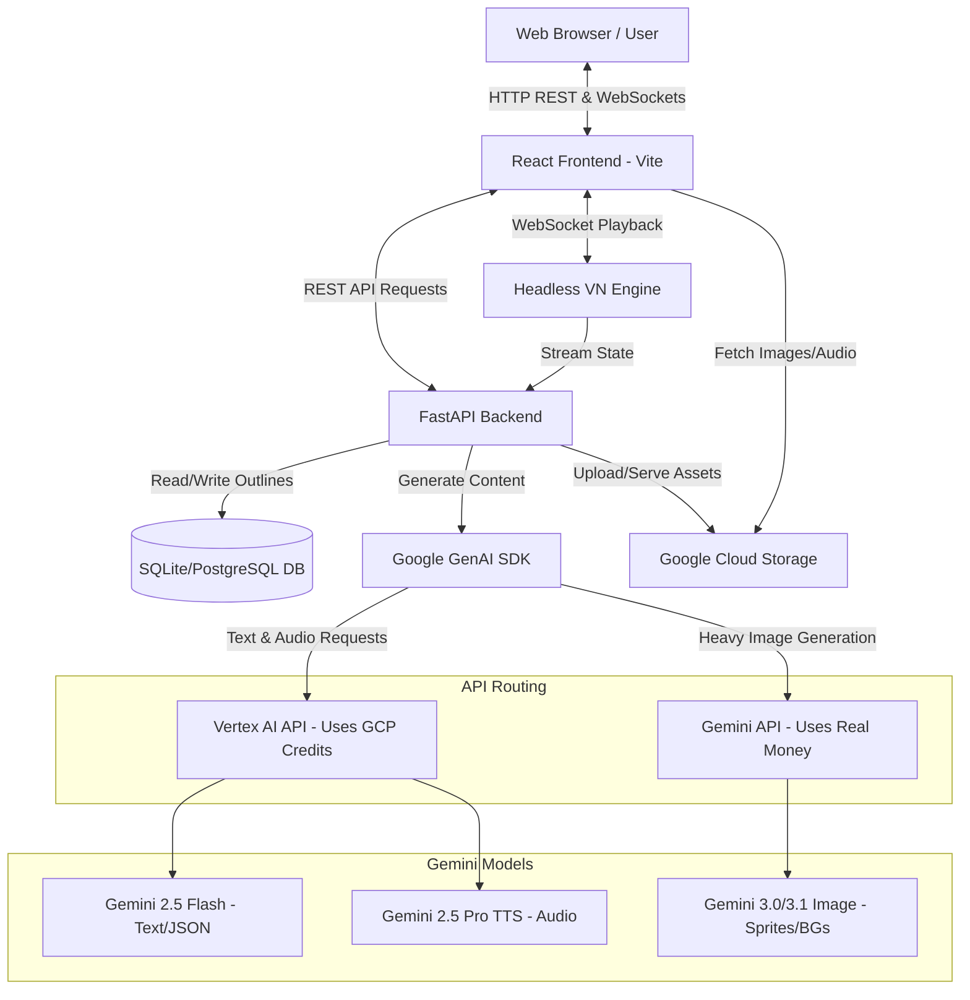

# AIVN: AI Visual Novel Generator

## Overview
AIVN is a next-generation AI agent that transforms a simple text prompt into a fully playable, interactive visual novel. Built for the **Creative Storyteller** category of the Gemini Live Agent Challenge, AIVN weaves together text, image generation, and audio synthesis to create a cohesive, multimodal narrative experience. 

The system leverages Google's Gemini models via the Google GenAI SDK to act as an automated creative director. It handles narrative branching, generates character sprites with consistent styles, synthesizes unique voices for each character, and produces high-quality background art.

## Features & Functionality
* **Automated Story Structuring**: Uses Gemini 2.5 Flash to expand a short logline into a multi-chapter screenplay with branching choices.
* **Instant Art Direction**: Uses Gemini 3.0/3.1 Image Preview models to generate character sprites (in specific poses and expressions) and background environments in a consistent art style (e.g., Anime, Western Comic).
* **Expressive Voice Acting**: Uses Gemini 2.5 Pro TTS to synthesize unique, emotive voice lines for every character dialogue.
* **Playable Web Engine**: Features a custom headless game engine that streams the generated assets and branching dialogue to the React frontend via WebSockets in real-time.
* **Cost & Quota Optimized Dual-API Routing**: Intelligently routes requests between the Vertex AI API and the Gemini (Generative AI) API to balance Cloud credits and rate limits.

## Technologies Used
* **Frontend**: React, TypeScript, Vite, Tailwind CSS.
* **Backend**: Python 3.12, FastAPI, SQLAlchemy, Alembic.
* **AI & Machine Learning**: Google GenAI SDK (Dual integration of Vertex AI API and Gemini API).
* **Models**: Gemini 2.5 Flash, Gemini 3.0 Pro Image Preview, Gemini 3.1 Flash Image Preview, Gemini 2.5 Pro TTS.
* **Google Cloud Services**: Google Cloud Run (Hosting), Google Cloud Storage (Asset Storage).

---

## Architecture Diagram

Below is the Mermaid architecture diagram illustrating how the system connects to the backend, database, frontend, and the hybrid AI API routing layer.



### System Flow
1. **Input**: User submits a synopsis and art style via the React Frontend.
2. **Orchestration**: The FastAPI backend receives the request and triggers the `StoryWorkflowService`.
3. **Text/Logic Generation**: Gemini 2.5 Flash generates a structured JSON outline of chapters, scenes, and branching dialogue. This is routed through Vertex AI to utilize available Google Cloud credits.
4. **Asset Generation**: The backend triggers concurrent tasks. Gemini 3.0/3.1 Image models generate transparent character sprites and background art. Due to strict Vertex AI rate limits for images, these requests are routed through the Gemini API. Concurrently, Gemini 2.5 TTS generates audio files via Vertex AI.
5. **Storage**: All assets are saved to Google Cloud Storage (or local output folder for dev).
6. **Playback**: The user clicks "Play". The React frontend opens a WebSocket connection to the Headless VN Engine on the backend, which feeds scene states, dialogue, choices, and asset URLs frame-by-frame.

---

## Spin-up Instructions

Follow this step-by-step guide to run the project locally or deploy it to Google Cloud.

### Prerequisites
* Python 3.12+
* Node.js 20+
* Google Cloud Account with Vertex AI enabled.
* A Gemini API Key.
* `uv` package manager installed (`pip install uv`).

### 1. Environment Variables
Create a `.env` file in the `backend` directory with the following variables:

```env
ENVIRONMENT=LOCAL
LOG_LEVEL=INFO
GEMINI_API_KEY=your_gemini_api_key_here
GOOGLE_APPLICATION_CREDENTIALS=/path/to/your/gcp-service-account.json
GOOGLE_CLOUD_BUCKET=aivn
DATABASE_URL=sqlite:///vn_story.db
```

### 2. Local Setup (Using Docker Compose)
The easiest way to run the application locally is using Docker Compose.

1. Ensure Docker Desktop is running.
2. Navigate to the root directory.
3. Run the following command:
   ```bash
   docker-compose up --build
   ```
4. Access the frontend at `http://localhost:3000` and the backend API docs at `http://localhost:8000/docs`.

### 3. Local Setup (Manual)

**Backend Setup:**
1. Navigate to the `backend` directory: `cd backend`
2. Install dependencies using uv: `uv sync`
3. Run database migrations: `uv run alembic upgrade head`
4. Start the FastAPI server: `uv run uvicorn api_app:app --host 0.0.0.0 --port 8000 --reload`

**Frontend Setup:**
1. Open a new terminal and navigate to the `frontend` directory: `cd frontend`
2. Install dependencies: `npm install`
3. Start the Vite development server: `npm run dev`
4. Access the web app at the URL provided in the terminal (usually `http://localhost:5173`).

### 4. Cloud Deployment (Google Cloud Run)
The project includes a GitHub Actions workflow (`.github/workflows/deploy.yml`) for automated deployment to Google Cloud Run. 

To deploy manually using the Google Cloud CLI:

**Deploy Backend:**
```bash
cd backend
gcloud run deploy aivn-backend \
  --source . \
  --region us-central1 \
  --allow-unauthenticated \
  --set-env-vars="GEMINI_API_KEY=your_key,DATABASE_URL=sqlite:///vn_story.db"
```

**Deploy Frontend:**
```bash
cd frontend
gcloud run deploy aivn-frontend \
  --source . \
  --region us-central1 \
  --allow-unauthenticated \
  --set-build-env-vars="VITE_API_URL=https://your-backend-url.run.app"
```

---

## Findings & Learnings

* **Dual-API Strategy for Cost & Limit Optimization**: We discovered that while the Vertex AI API allows the use of Google Cloud credits, its rate limits for image models are extremely low. The Gemini API (Generative AI API) offers much higher rate limits for image generation but does not support Google Cloud credits, meaning it bills real money. To bypass the image generation bottleneck while minimizing out-of-pocket costs, we implemented a hybrid approach. We route text and audio generation tasks through Vertex AI to maximize our available credits, and exclusively route the heavy, high-volume image generation tasks through the Gemini API. This architecture perfectly balances cost-efficiency with performance.
* **Multimodal Synchronization**: Chaining text, image, and audio generation requires strict data contracts. Forcing Gemini 2.5 Flash to output strictly typed JSON (using Pydantic schemas) was essential to ensure the subsequent Image and TTS prompts received exact character names and context.
* **Stateful WebSockets**: Passing game states from a Python-based headless engine to a React frontend taught us how to effectively manage asynchronous event loops and prevent UI desynchronization during branching choices.
* **Prompt Consistency**: Generating consistent character sprites across multiple poses was challenging. We solved this by creating a highly descriptive "base appearance" prompt for the character, which is prepended to the pose-specific prompts, ensuring the model maintains the character's core physical traits across generations.